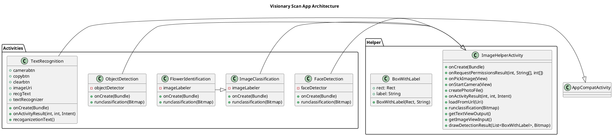

# Visionary Scan Android Application

## Table of Contents
- [Overview](#overview)
- [Prerequisites](#prerequisites)
- [Installation](#installation)
- [Features](#features)
- [Architecture](#architecture)
- [Usage](#usage)
- [External Interface Requirements](#external-interface-requirements)
- [Future Enhancements](#future-enhancements)
- [Contributing](#contributing)

## Overview
The Visionary Scan Android Application leverages Google's ML Kit and TensorFlow Lite to provide powerful image recognition capabilities. The application includes several activities for detecting faces, identifying flowers, classifying images, detecting objects, and recognizing text. This project showcases the integration of machine learning models with Android development to create a seamless user experience for real-time image analysis.

## Prerequisites
Before you begin, ensure you have met the following requirements:
- **Android Studio**: [Download and install Android Studio](https://developer.android.com/studio).
- **Java Development Kit (JDK)**: Make sure JDK 8 or higher is installed.
- **Android Device or Emulator**: You will need a physical Android device or an emulator to run the application.
- **Internet Connection**: Required for downloading dependencies and ML models.
- **ML Kit and TensorFlow Lite**: Ensure these libraries are included in your project's `build.gradle` file.

## Installation
To build and run the application, follow these steps:

1. Clone the repository:
    ```sh
    git clone https://github.com/ShahnawazKhan-code/VisionaryScan.git
    ```
2. Open the project in Android Studio.
3. Sync the project with Gradle files.
4. Build and run the application on an Android device or emulator.

## Features
- **Face Detection**: Detects faces in an image and tracks unique faces across images.
- **Flower Identification**: Identifies different types of flowers from an image.
- **Image Classification**: Classifies general images into various categories.
- **Object Detection**: Detects and labels objects within an image.
- **Text Recognition**: Extracts and recognizes text from images.

## Architecture
The application follows a modular architecture, with each feature implemented as a separate activity. The core functionalities for image handling and display are encapsulated within the `ImageHelperActivity` class. Specific activities extend this base class to implement feature-specific logic.



## Usage
1. Launch the application on your Android device.
2. Select the desired feature from the main menu:
   - Face Detection
   - Flower Identification
   - Image Classification
   - Object Detection
   - Text Recognition
3. Follow the on-screen instructions to capture or select an image.
4. View the results displayed on the screen.

## External Interface Requirements
- **Camera**: Used to capture images for analysis.
- **Storage**: Required to store and retrieve images.
- **Google ML Kit**: Utilized for various machine learning tasks such as face detection, object detection, and text recognition.
- **TensorFlow Lite**: Used for custom image classification models.

## Future Enhancements
- **Real-Time Object Tracking**: Enhance the object detection feature to track objects in real-time video streams.
- **Additional Image Models**: Integrate more pre-trained models for specific use cases, such as animal detection or plant disease identification.
- **Improved UI/UX**: Refine the user interface for a more intuitive and seamless experience.
- **Multi-Language Support**: Add support for multiple languages to cater to a wider audience.
- **Offline Functionality**: Improve offline capabilities to ensure the app works without an internet connection.

## Contributing
Contributions are welcome! Please submit a pull request or open an issue to discuss your ideas.
